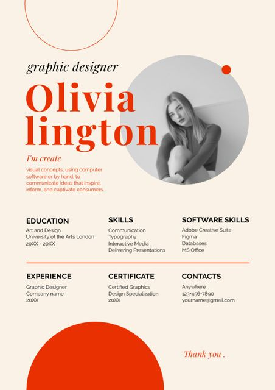

# How is the course/semester going for me so far?

## So far...

This course is going well! The course website is **extremely** helpful by going into detail and providing tutorials so I can follow along with the material. As for the semester, it's overall going *alright*. 

There are some classes I have:

1. Producing
2. Professional Portfolio

They are the ones stressing me out the most because they are so intensive. But I know I can do it and will be alright. 

For Professional Portfolio we have to create our own brand from the ground up. This includes creating logos, mood/vision boards, a website, and branding. A website I'll be using a lot to gain inspiration for mood boards and logos is [Pinterest](https://www.pinterest.com/). 

Here are some of the images I have found so far that are inspiring to me and are in the aesthetic I see my logo/website having:

